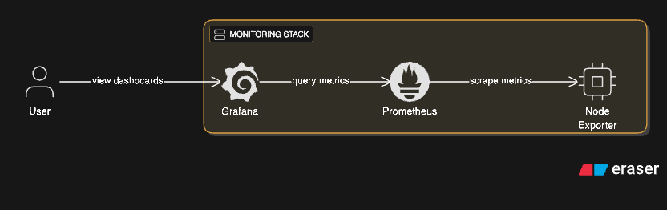
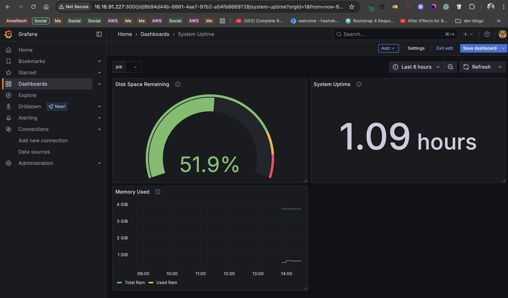

# Prometheus + Grafana Monitoring Stack (Dockerized)

This project sets up a **Prometheus + Grafana stack** using Docker Compose to collect and visualize metrics from a Linux system via **Node Exporter**.

---

## Architecture



---

## Stack Components

| Component     | Purpose                                      |
|---------------|----------------------------------------------|
| Prometheus    | Monitoring system to scrape and store metrics |
| Node Exporter | Exposes host-level system metrics to Prometheus |
| Grafana       | Visualization platform for Prometheus metrics |

---

## Project Structure

```bash
.
├── compose.yml
├── prometheus.yml
└── README.md
├── screenshots

```

---

## Getting Started

```
git clone https://github.com/YOUR_USERNAME/prometheus-grafana-lab.git
cd prometheus-grafana-lab

```
---

## Start the Monitoring Stack

```
docker compose up -d

```
Ensure you have Docker installed.

--- 

## 3. Access the UIs

| Service       | URL                                                            |
| ------------- | -------------------------------------------------------------- |
| Prometheus    | [http://localhost:9090](http://server-ip:9090)                 |
| Grafana       | [http://localhost:3000](http://server-ip:3000)                 |
| Node Exporter | [http://localhost:9100/metrics](http://server-ip:9100/metrics) |


---

## Grafana Login

- Username: admin
- Password: admin

You will be prompted to change the password on first login.

---

## Setting Up Prometheus Data Source in Grafana

- Go to http://server-ip:3000
- Navigate to ⚙️ → Data Sources → Add Data Source.
- Choose Prometheus.
- Set the URL to: http://server-ip:9090
- Click Save & Test.

---

## Creating a New Grafana Dashboard (From Tutorial)

As part of the lab, we created a custom Grafana dashboard to visualize Prometheus metrics using **Stat**, **Time series**, and **Gauge** panels.

### Steps to Create a Dashboard

1. **Login to Grafana**
   - Go to `http://localhost:3000` (or your EC2 IP).
   - Login with:
     - **Username**: `admin`
     - **Password**: `admin` (prompted to change on first login)

2. **Create a New Dashboard**
   - Click **“+”** (left sidebar) → **Dashboard**
   - Click **“Add new panel”**

3. **Panel 1: Uptime (Stat Panel)**
   - **Query:**
     ```promql
     node_time_seconds - node_boot_time_seconds
     ```
   - **Visualization**: Stat
   - **Title**: “Uptime”
   - Click **Apply**

4. **Panel 2: Memory Usage (Gauge Panel)**
   - **Query:**
     ```promql
     node_memory_MemTotal_bytes - node_memory_MemAvailable_bytes
     ```
   - **Unit**: bytes (auto)
   - **Thresholds**: 70% = yellow, 90% = red
   - **Visualization**: Gauge
   - **Title**: “Memory Usage”

5. **Panel 3: Disk Usage (Gauge Panel)**
   - **Query:**
     ```promql
     1 - (node_filesystem_avail_bytes{mountpoint="/"} / node_filesystem_size_bytes{mountpoint="/"})
     ```
   - **Unit**: percent (0–1 or scale to 100%)
   - **Visualization**: Gauge
   - **Title**: “Disk Usage”

6. **Panel 4: CPU Usage Over Time (Time Series Panel)**
   - **Query:**
     ```promql
     100 - (avg by(instance) (rate(node_cpu_seconds_total{mode="idle"}[5m])) * 100)
     ```
   - **Visualization**: Time series
   - **Title**: “CPU Usage Over Time”

7. **Save the Dashboard**
   - Click **Save** (💾 icon)
   - Name it: `Node Monitoring Dashboard`

### Sample Dashboard Overview

Your custom dashboard should now show:
- Uptime (stat)
- Live memory usage (gauge)
- Disk usage (gauge)
- CPU usage trend (time series)



Each panel uses metrics scraped by Prometheus from Node Exporter, making it a real-time monitoring dashboard.


> 💡 Tip: You can export this dashboard as JSON and version-control it or reuse it across environments.

---

## Questions and Answers

### Section 1: Architecture and Setup Understanding

#### Question 1: Container Orchestration Analysis
Examine the Docker Compose configuration used in this lab. Explain why the Node Exporter container requires mounting host directories (/proc, /sys, /) and what would happen if these mounts were removed or configured incorrectly. How does this design decision reflect the principle of containerized monitoring?

**Answer:**
If we remove or misconfigure these mounts, Node Exporter would collect data from inside the container instead, which defeats the purpose. It wouldn’t reflect the actual host’s performance. This shows the idea of containerized monitoring where a container watches the host without modifying it.

#### Question 2: Network Security Implications
The lab creates a custom Docker network named "prometheus-grafana". Analyze the security implications of this setup versus using the default Docker network. What potential vulnerabilities could arise from the current port exposure configuration (9090, 9100, 3000), and how would you modify the setup for a production environment?

**Answer:**
The custom network prometheus-grafana helps organize the services to communicate internally, but exposing ports 9090, 9100, and 3000 directly to the host system can be risky in production. Anyone who finds those ports open could access Prometheus or Grafana dashboards without logging in (especially since Prometheus doesn’t require a login by default). In a production setup, I would avoid exposing those ports publicly use a reverse proxy like Nginx basic auth or SSL.

#### Question 3: Network Security Implications
Compare the volume mounting strategies used for Prometheus data versus Grafana data in the Docker Compose file. Explain why different approaches might be needed for different
components and what would happen to your dashboards and historical metrics if you removed these volume configurations.

**Answer:**
Prometheus has a prometheus_data volume that stores the scraped metrics, and Grafana has grafana_data to save dashboards and settings.

If these volumes were removed, restarting the containers would cause Prometheus to lose all metrics history and Grafana would reset as if it is freshly installed that is, all dashboards would be gone. Prometheus and Grafana have different persistence needs, so separating the volumes makes sense.

---

### Section 2:  Metrics and Query Understanding

#### Question 4: PromQL Logic Breakdown
The tutorial uses this query for calculating uptime:
`node_time_seconds - node_boot_time_seconds`
Explain step-by-step what each metric represents, why subtraction gives us uptime, and what potential issues could arise with this calculation method. Propose an alternative approach and justify when you might use it instead.

**Answer:**
The query `node_time_seconds - node_boot_time_seconds` calculates uptime. `node_time_seconds` shows the current system time, while `node_boot_time_seconds` is when the system last booted. Subtracting them gives how long the system has been running.
A problem could be if the clock is off or if one of the metrics isn’t available, the result would be wrong. An alternative might be using node_boot_time_seconds alone and converting it to uptime by subtracting it in Grafana using system current time. 

#### Question 5: Memory Metrics Deep Dive
The lab uses `node_memory_MemTotal_bytes - node_memory_MemAvailable_bytes` to calculate
memory usage. Research and explain why this approach is preferred over using
`node_memory_MemFree_bytes`. What's the fundamental difference between "free" and
"available" memory in Linux systems, and how does this impact monitoring accuracy?

**Answer:**
The tutorial used `node_memory_MemTotal_bytes - node_memory_MemAvailable_bytes` instead of `node_memory_MemFree_bytes`. This is better because "available" memory includes buffers and cache that can be reused, while "free" only shows unused memory.

In Linux, memory is often used for caching, so “free” memory might look low even when the system isn’t under pressure. Using “available” gives a more accurate idea of how much memory can actually be used. That’s why it’s the recommended way.

#### Question 6: Memory Metrics Deep Dive
Analyze this filesystem usage query:
1 - (node_filesystem_avail_bytes{mountpoint="/"} / node_filesystem_size_bytes{mountpoint="/"})

Break down the mathematical logic, explain why the result needs to be subtracted from 1, and discuss what could go wrong if you monitoring multiple mount points with this approach. How would you modify this query to exclude temporary filesystems?

**Answer:**
The query calculates how much of the root filesystem is used. It divides available bytes by total size, and subtracts from 1 to get the usage instead of the free space.

If there are multiple mount points, this query only checks the root. You could miss other disks or partitions. Also, it might include virtual filesystems like /proc or /sys, which don’t reflect real disk usage.

To fix this, I would exclude filesystems like this:
```
node_filesystem_avail_bytes{fstype!~"tmpfs|proc|sysfs"}

```
---

### Section 3: Visualization and Dashboard Design

#### Question 7: Visualization Type Justification
The tutorial uses three different visualization types: Stat, Time Series, and Gauge. For each visualization created in the lab, justify why that specific type was chosen over alternatives. What criteria should guide visualization selection, and when might your choices be suboptimal?

**Answer**
- *Stat* panels are great for showing a single number like system uptime.
- *Time Series* charts are best for tracking changes over time like CPU usage.
- *Gauge panels* are perfect for disk space or memory usage where you want to see how close you are to a limit.

These choices were accurate because they match what we wanted to observe. If we used a Time Series for uptime, it might not be very useful. But if we used Stat for CPU over time, we would have lose the trend. Choosing the right type really helps with clarity.

#### Question 8: Threshold Configuration Strategy
Explain the reasoning behind the 80% threshold setting for disk usage in the gauge chart. Research industry standards and propose a more sophisticated alerting strategy that considers different types of systems (database servers, web servers, etc.). How would you implement multi-level thresholds that provide actionable insights?

**Answer**
The gauge chart in the tutorial used an 80% threshold for disk usage. This is a common warning level because systems often need room to function properly and logs or backups might suddenly fill up space.

For more advanced setups, I will use multi-level thresholds, like:

- ok      at 50%
- Warning at 70%
- Critical at 90%


Different systems need different thresholds. For example, a DB server should alert sooner than a web server. Grafana supports color bands, so I will configure yellow for warning, red for danger and green for ok/good.

#### Question 8: Dashboard Variable Implementation
The tutorial introduces dashboard variables using the $job variable. Explain how this variable system works internally in Grafana, what happens when you have multiple values for a variable, and design a scenario where poorly implemented variables could break your dashboard. How would you test variable robustness?

**Answer**
The $job variable lets you choose which job (like Prometheus or Node Exporter) to view metrics for. Grafana internally fetches the distinct values from Prometheus labels.

If you have multiple values and you don’t handle them correctly in your queries, it could break panels or show no data. To test, I will try selecting all options, and see how the dashboards behave. You can also set default values and regex filters to avoid empty results.

---

### Section 4: Production and Scalability Considerations

#### Question 10: Resource Planning and Scaling
Based on your lab experience, calculate the approximate resource requirements (CPU, memory,storage) for monitoring 100 servers using this setup. Consider metric ingestion rates, retention periods, and dashboard query load. What bottlenecks would you expect to encounter first, and how would you address them?

**Answer**
For 100 servers, Prometheus would scrape a lot more metrics so i will go for the following:

- Memory: 4–8GB or more
- CPU: 2–4 vCPUs minimum
- Storage: ~10–20GB per week, depending on scrape interval and metrics

The bottleneck would likely be Prometheus storage. I will likely increase scrape interval or use remote storage for scalability.

#### Question 11: High Availability Design
The current lab setup is single-node. Design a high-availability architecture for this monitoring stack that can handle component failures. Explain your approach to data consistency, load balancing, and disaster recovery. What trade-offs would you make between complexity and reliability?

**Answer**

#### Question 12: Security Hardening Analysis
Identify at least five security vulnerabilities in the lab setup and propose specific remediation strategies. Consider authentication, authorization, network security, and data protection. How would you implement secrets management and secure communication between components?

**Answer**
Security issues in the lab setup:

- No authentication on Prometheus
- No HTTPS for any UI
- Open ports to public
- Docker volumes unencrypted
- No secrets management

To fix:

- Use Nginx reverse proxy with SSL and HTTP auth
- Add Grafana and Prometheus user login
- Restrict ports using firewall/VPC rules
- Encrypt data at rest
- Store secrets using .env or Docker secrets

---

### Section 5: Troubleshooting and Operations

#### Question 13: Debugging Methodology
Describe a systematic approach to troubleshooting when Prometheus shows a target as
"DOWN" in the targets page. Walk through the diagnostic steps you would take, including
command-line tools, log analysis, and configuration verification. What are the most common causes and their solutions?

**Answer**
When Prometheus shows a target as DOWN:

- Go to Status → Targets page
- Click the “DOWN” label to see error (e.g., timeout, connection refused)
- Check container logs:
```
docker logs node-exporter

```
- Verify config in prometheus.yml matches the actual hostname/IP
- Use curl or telnet to test port access manually

#### Question 14: Performance Optimization
After running the lab, analyze the query performance of your dashboards. Identify which queries might be expensive and explain why. Propose optimization strategies for both PromQL queries and Grafana dashboard design. How would you monitor the monitoring system itself?

**Answer**
Some PromQL queries like rate() over a long time range can be slow. Also, dashboards with too many panels load slowly.

To fix:

- Use avg_over_time or increase scrape interval
- Simplify dashboards, avoid wide queries
- Enable query caching in Grafana
- Use dedicated dashboards for different roles (dev vs ops)

To monitor Prometheus itself, scrape its /metrics and watch its CPU and memory usage.

#### Question 15: Capacity Planning Scenario
You notice that Prometheus is consuming increasing amounts of disk space over time. Analyze the factors that contribute to storage growth, calculate retention policies based on business requirements, and design a data lifecycle management strategy. How would you balance historical data availability with resource constraints?

**Answer**
Prometheus storage grows over time with:

- Number of metrics
- Scrape interval
- Retention period

Default is 15s interval and 15 days retention, which can use tens of GBs. I would:

- Reduce retention in prometheus.yml:
--storage.tsdb.retention.time=7d

- Use remote_write to archive data

- Set disk alerts when usage exceeds 70%

Also, I will keep recent data locally and push old data to cheaper storage.

---

Inspired by the BetterStack guide: [Visualize Prometheus Metrics with Grafana](https://betterstack.com/community/guides/monitoring/visualize-prometheus-metrics-grafana/)
